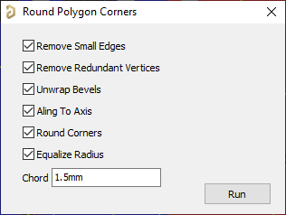

# Round Polygon Corners
Iterates through each polygon and make it corners round.

## Motivation
In my company one of pcb best practice is all polygon corners must be round. And it's real hard to do because: no way to round all corner by click, no way to set round radius (or chord) value, no way to move sides after corner round (use need unround it, move side, round again). This script helps.

## How to Run
1. Run script from pcb layout.
2. A GUI will open. Select options and run.

## Features
Basic features could be illustrated with this screens step by step:
0. Original Polygon

1. Remove Small Edges

2. Remove Redundant Vertices

3. Unwrap Bevels

4. Aling To Axis

5. Round Corners

6. Equalize Radius

